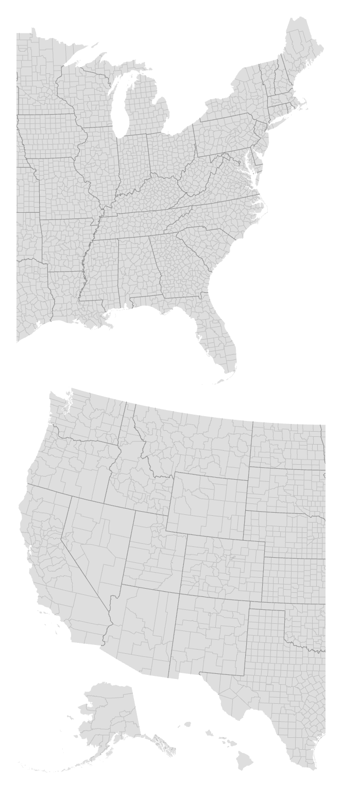
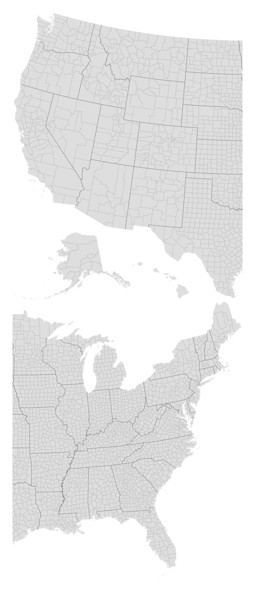

# d3-geo-albers-usa-vertical

Map projections compatible with [d3-geo](https://d3js.org/d3-geo) that adapt the [Albers USA projection](https://d3js.org/d3-geo/conic#geoAlbersUsa) for vertical screens.

## Installing

If you use NPM, `npm install d3-geo-albers-usa-vertical`.

```js
import { geoAlbersUsaVertical } from "d3-geo-albers-usa-vertical";

const projection = geoAlbersUsaVertical();
```

[Try d3-geo-albers-usa-vertical in your browser](https://observablehq.com/@harrystevens/d3-geo-albers-usa-vertical).

## API Reference

<a name="geoAlbersUsaVertical" href="#geoAlbersUsaVertical">#</a> d3.<b>geoAlbersUsaVertical</b>() · [Source](https://github.com/HarryStevens/d3-geo-albers-usa-vertical/blob/main/src/albersUsaVertical.js)

<a href="https://observablehq.com/@harrystevens/d3-geo-albers-usa-vertical"></a>

This is a U.S.-centric composite projection of four [geoConicEqualArea](https://d3js.org/d3-geo/conic#geoConicEqualArea) projections: On the top half of the map, [geoAlbers](https://d3js.org/d3-geo/conic#geoAlbers) is used for the eastern part of the lower fourty-eight states. On the bottom half of the map, geoAlbers is used for the western part of the lower forty-eight states, and separate conic equal-area projections are used for Alaska and Hawaii. The scale for Alaska is diminished: it is projected at 0.35× its true relative area.

The constituent projections have fixed clip, center and rotation, and thus this projection does not support [<i>projection</i>.center](https://d3js.org/d3-geo/projection#projection_center), [<i>projection</i>.rotate](https://d3js.org/d3-geo/projection#projection_rotate), [<i>projection</i>.clipAngle](https://d3js.org/d3-geo/projection#projection_clipAngle), or [<i>projection</i>.clipExtent](https://d3js.org/d3-geo/projection#projection_clipExtent).

<a name="geoAlbersUsaPrVertical" href="#geoAlbersUsaPrVertical">#</a> d3.<b>geoAlbersUsaPrVertical</b>() · [Source](https://github.com/HarryStevens/d3-geo-albers-usa-vertical/blob/main/src/albersUsaPrVertical.js)

<a href="https://observablehq.com/@harrystevens/d3-geo-albers-usa-pr-vertical"></a>

A composite projection identical to the <a href="#geoAlbersUsaVertical">U.S. states vertical projection</a> but with another inset for Puerto Rico, projected with [geoConicEqualArea](https://d3js.org/d3-geo/conic#geoConicEqualArea) and placed to the right of Florida.

<a name="projection_reverse" href="#projection_reverse">#</a> <i>projection</i>.<b>reverse</b>([<i>reverse</i>])

If <i>reverse</i> is specified, sets whether the projection’s layout is reversed. If true, the projection is reversed: the top portion of the map shows the western half of the contiguous U.S. and the Alaska and Hawaii insets, while the bottom portion of the map shows the eastern half of the contiguous U.S. If <i>reverse</i> is not specified, returns the current setting, which defaults to false.

